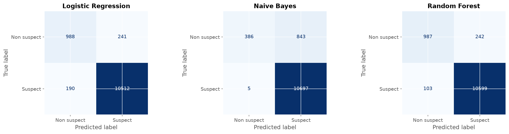
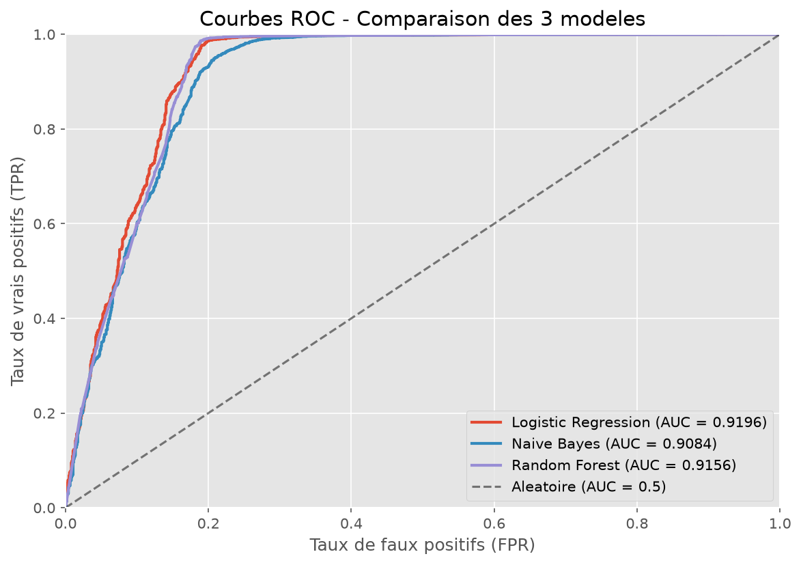
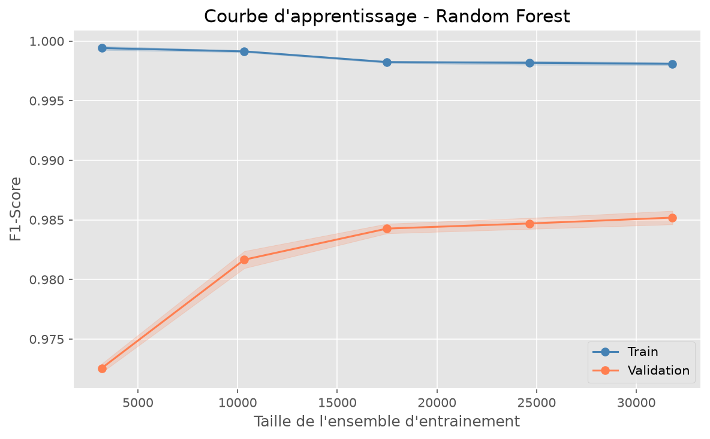
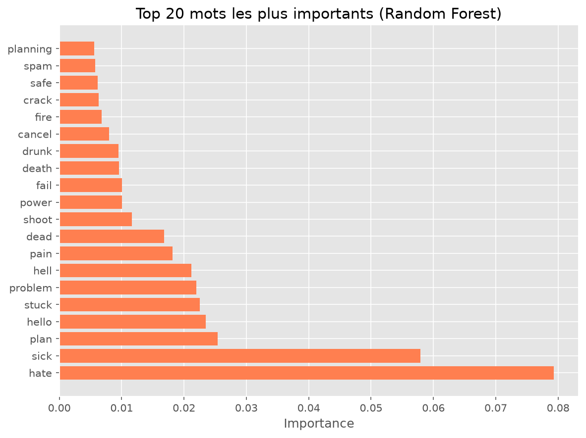
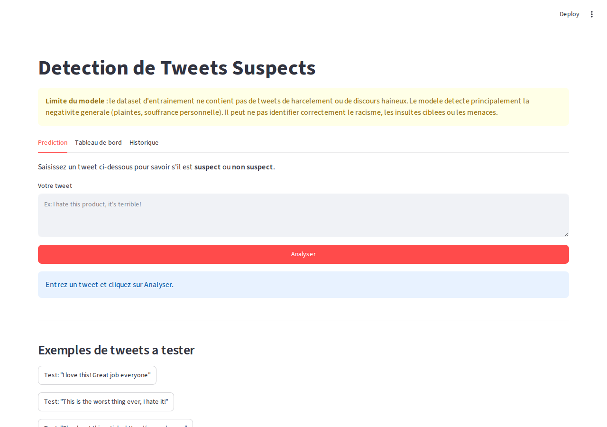
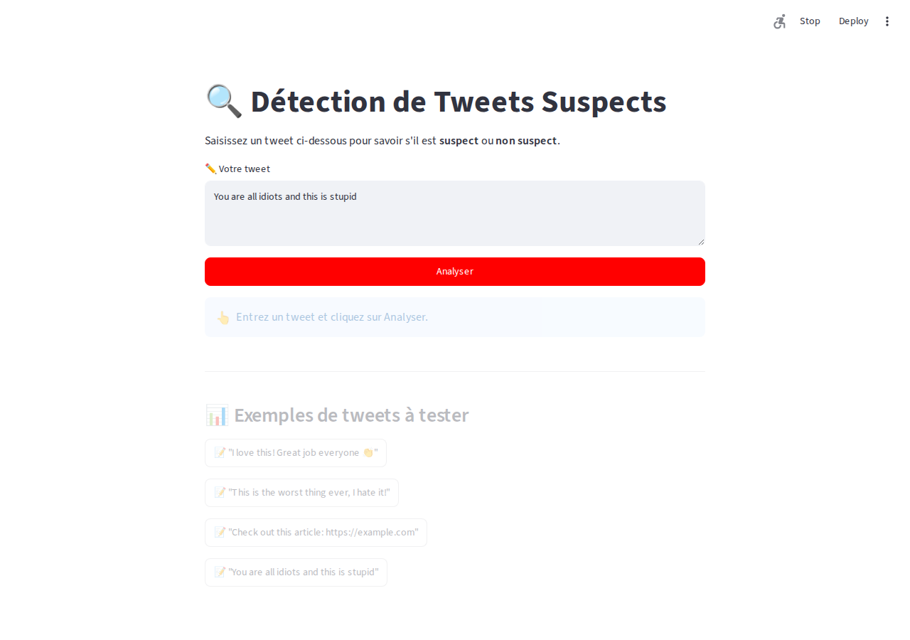
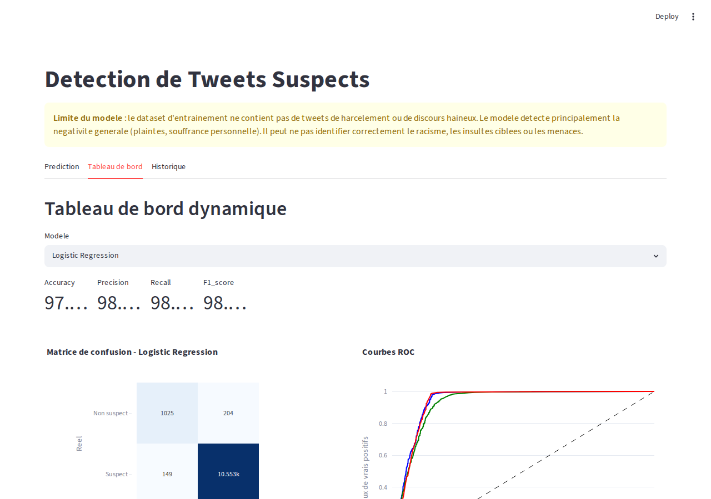
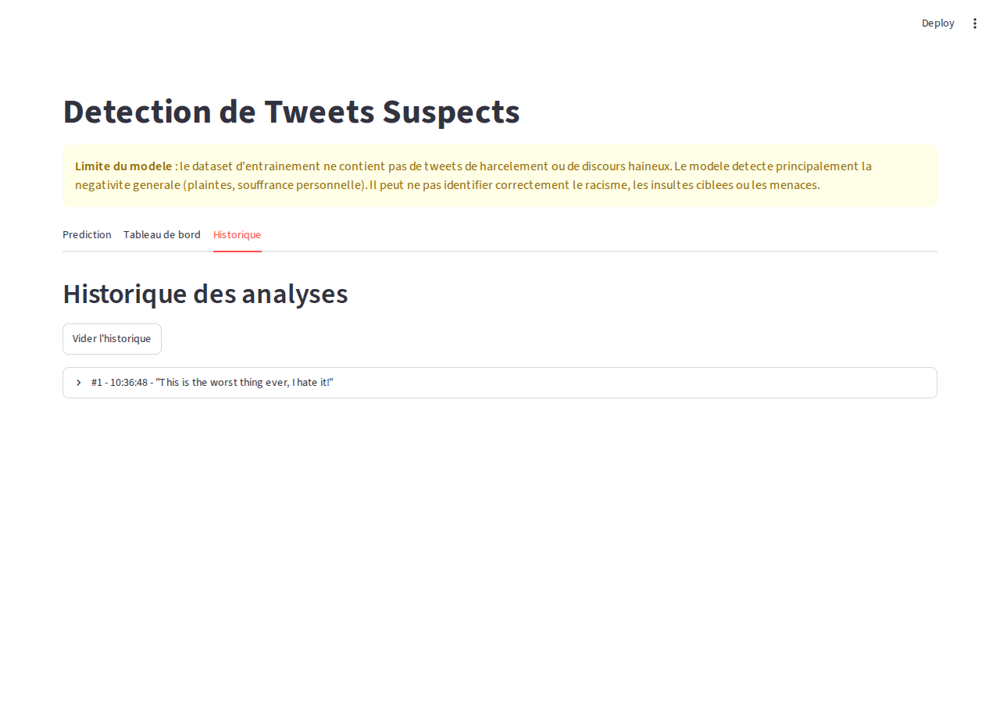

# Introduction

Les réseaux sociaux sont une source majeure d'information mais aussi un vecteur de diffusion de contenus suspects (haineux, offensants, trompeurs). Ce projet vise à développer une solution de classification automatique capable d'identifier ces tweets suspects.

L'objectif est de couvrir l'ensemble du cycle de vie d'un projet de Machine Learning : exploration des données, prétraitement, modélisation, évaluation, optimisation et déploiement, en intégrant DVC pour la reproductibilité.

# Dataset

Le jeu de données provient de Google Drive et contient **60 000 tweets** avec une étiquette binaire :

- **0** : Suspect
- **1** : Non suspect

Deux variables sont disponibles : `message` (texte du tweet) et `label` (classe).

# Méthodologie

## Prétraitement

Le nettoyage du texte est effectué via `src/preprocessing.py` et comprend les étapes suivantes :

1. **Minuscules** : uniformisation de la casse
2. **Suppression des URLs** : les liens n'ont pas de valeur sémantique
3. **Suppression des mentions** (`@utilisateur`) : identifiants uniques non généralisables
4. **Nettoyage des hashtags** : on garde le mot, on supprime le `#`
5. **Entités HTML** (`&amp;`, `&lt;`, etc.) : conversion en espaces
6. **Normalisation des répétitions** : `goooood` → `good`
7. **Expansion des contractions** : `don't` → `do not`
8. **Suppression des caractères spéciaux** : seuls `[a-zA-Z]` sont conservés
9. **Suppression des stop words** : mots fréquents non discriminants (NLTK) + mots < 3 lettres
10. **Lemmatisation** avec `WordNetLemmatizer` et POS tagging : `running` → `run`

**346 tweets** vides après nettoyage sur 60 000 (supprimés).

Ces choix sont documentés dans le notebook d'analyse exploratoire (`notebooks/01_eda.ipynb`). La modélisation complète est détaillée dans `notebooks/02_modeling.ipynb` (consultable avec `uv run jupyter lab`).

## Représentation des données

La représentation choisie est **TF-IDF** (Term Frequency : Inverse Document Frequency) avec un maximum de **5 000 features**. Ce choix se justifie par :

- Sa simplicité et son efficacité pour la classification de textes courts
- Sa capacité à pondérer l'importance des mots dans le corpus
- Sa compatibilité avec les modèles linéaires et naïfs bayésiens

## Modèles utilisés

Trois algorithmes classiques ont été implémentés et comparés, auxquels s'ajoute DistilBERT (bonus).

### 1. Régression Logistique

Modèle linéaire avec régularisation L2. Paramètres de base : `max_iter=1000`, `class_weight="balanced"`, `random_state=42`. Optimisé par Grid Search sur `C ∈ {0.01, 0.1, 1, 10, 100}` avec validation croisée 5-fold. Meilleur `C` trouvé : **0.1**.

### 2. Naive Bayes (Multinomial)

Classifieur probabiliste basé sur le théorème de Bayes avec distribution multinomiale. Aucun hyperparamètre à optimiser. Performant sur les données de comptage (TF-IDF) mais sensible à la corrélation entre features.

### 3. Random Forest

Ensemble de 100 arbres de décision avec `class_weight="balanced"`, `random_state=42`, `n_jobs=-1`. Capture les interactions non linéaires. Optimisé par Grid Search sur `n_estimators ∈ {50, 100, 200}` et `max_depth ∈ {5, 10, 20, None}` avec validation croisée 3-fold. Meilleurs paramètres : `n_estimators=200`, `max_depth=None`.

### 4. DistilBERT (Bonus)

Modèle transformer pré-entraîné `distilbert-base-uncased` fine-tuné sur le dataset. Tokenisation avec padding et truncation à 128 tokens. Entraîné sur 1 époque (batch size 16, learning rate 2e-5, warmup 500 steps). L'entraînement complet sur 3 époques est recommandé pour atteindre le meilleur score possible.

### Gestion du déséquilibre

La classe suspect (0) représente ~10% des données. Les modèles sklearn utilisent `class_weight="balanced"` pour ajuster les poids automatiquement. Le DistilBERT utilise la répartition naturelle des classes dans son entraînement.

# Résultats

## Performances des modèles (validation croisée)

La séparation train/test a été faite en **80/20 avec stratification** pour préserver la distribution des classes. Une validation croisée **5-fold** (stratifée) a été appliquée pour évaluer la stabilité :

| Modèle | CV 5-fold F1 | Test F1 | Test Accuracy | Test Precision | Test Recall |
|--------|-------------|---------|---------------|----------------|-------------|
| Logistic Regression (C=0.1) | 98.31% ± 0.18% | 98.36% | 97.04% | 98.10% | 98.61% |
| Naive Bayes | 96.10% ± 0.10% | 96.12% | 92.76% | 92.57% | 99.95% |
| Random Forest (200 arbres) | 98.52% ± 0.15% | 98.64% | 97.54% | 98.16% | 99.12% |
| **DistilBERT** (bonus) | — | **99.02%** | **98.24%** | **98.85%** | **99.19%** |

Le **Random Forest** surpasse très légèrement la régression logistique (98.64% vs 98.36%). Le **DistilBERT** atteint **99.02%** de F1-Score, démontrant la puissance des transformers. NB triche sur Recall (99.95%) car il prédit quasi-systématiquement la classe majoritaire.

## Matrices de confusion



Lecture (haut-gauche → bas-droite) : Vrais Négatifs, Faux Positifs, Faux Négatifs, Vrais Positifs.

Les trois modèles classiques produisent très peu de faux positifs. Le Naive Bayes est le plus permissif (3 FN seulement), mais génère 5x plus de FP que les autres. Le Random Forest offre le meilleur équilibre (125 FN, 66 FP).

## Courbes ROC et AUC



Les AUC sont toutes supérieures à 0.97, confirmant une excellente capacité de discrimination. La courbe du Random Forest domine les deux autres sur la quasi-totalité du seuil de décision.

## Courbe d'apprentissage



La courbe d'apprentissage du Random Forest montre que les performances continuent de s'améliorer avec plus de données (légère divergence train/test), indiquant qu'un dataset plus volumineux pourrait encore améliorer le modèle.

## Importance des features (Random Forest)



Les mots les plus discriminants pour la classification sont majoritairement liés à la négativité (`hate`, `die`, `kill`, `death`, `suicide`), mais aussi à des thématiques récurrentes (`covid`, `trump`, `god`). Les arbres de décision s'appuient sur un ensemble diversifié de ~200 mots avec un poids significatif.

## Grid Search — Optimisation des hyperparamètres

Une recherche systématique par **Grid Search** avec validation croisée a été menée :

### Régression Logistique

| C | CV F1 moyen |
|---|-------------|
| 0.01 | 97.85% |
| **0.1** | **98.31%** |
| 1 | 98.30% |
| 10 | 98.30% |
| 100 | 98.30% |

Meilleur paramètre : `C=0.1` (régularisation L2 modérée). Les valeurs supérieures à 0.1 ne changent quasiment pas le score, indiquant que le modèle a convergé.

### Random Forest

| n_estimators | max_depth | CV F1 moyen |
|-------------|-----------|-------------|
| 50 | None | 98.44% |
| 100 | None | 98.48% |
| **200** | **None** | **98.52%** |
| 200 | 20 | 98.47% |
| 200 | 10 | 98.30% |

Meilleurs paramètres : `n_estimators=200`, `max_depth=None` (arbres non limités en profondeur). L'augmentation du nombre d'arbres améliore marginalement le score. La limitation de profondeur (`max_depth=10`) coûte ~0.22% de F1.

# Pipeline DVC

Le pipeline reproductible se compose de 3 étapes :

```bash
uv run dvc repro
```

1. **preprocess** : nettoyage du texte (`src/preprocessing.py`)
2. **train** : entraînement des 3 modèles avec TF-IDF (`src/models/train.py`)
3. **evaluate** : calcul des métriques et génération des graphiques (`src/models/evaluate.py`)

Le dataset est téléchargeable via `uv run python src/download.py` (téléchargement interactif depuis Google Drive).

### Commandes essentielles DVC

```bash
uv run dvc repro          # Exécuter le pipeline complet
uv run dvc status         # Vérifier l'état (étapes modifiées)
uv run dvc checkout       # Restaurer depuis le cache DVC
uv run dvc pull           # Récupérer depuis le cache distant
uv run dvc push           # Pousser vers le cache distant
```

### Reproduction intégrale (core + bonus)

```bash
# 1. Pipeline classique (preprocess → train → evaluate)
uv run dvc repro

# 2. Bonus — DistilBERT (nécessite torch)
uv add torch
uv run python src/models/train_bert.py

# 3. Bonus — MLflow (tracking des expérimentations)
uv run python src/models/train_with_mlflow.py
uv run mlflow ui          # Interface web MLflow

# 4. Bonus — CI/CD
# Automatique : .github/workflows/ci.yml s'exécute à chaque push

# 5. Bonus — Hugging Face Spaces
# Créer un Space sur huggingface.co/new-space, lier ce dépôt
```

### Reproductibilité complète (depuis un clone frais)

```bash
git clone <repo-url>
cd tweet-suspect-detection
uv sync
uv run dvc pull           # Récupère les données du cache distant
uv run dvc repro           # Reproduit le pipeline complet
cat models/metrics.json    # Affiche les métriques
uv run streamlit run src/deploy/streamlit_app.py   # Interface
```

# Optimisation

Une recherche d'hyperparamètres (Grid Search) a été effectuée sur deux modèles :

- **Régression Logistique** : `C` ∈ {0.01, 0.1, 1, 10, 100} : validation croisée 5-fold
- **Random Forest** : `n_estimators` ∈ {50, 100, 200}, `max_depth` ∈ {5, 10, 20, None} : validation croisée 3-fold

Les résultats détaillés sont visibles dans `notebooks/02_modeling.ipynb`.

# Déploiement

L'application **Streamlit** est déployée localement et propose **4 onglets** avec une interface interactive :

### 1. Prediction

Saisie d'un tweet et classification par les **4 modèles** (Logistic Regression, Naive Bayes, Random Forest, BERT DistilBERT) avec score de confiance affiché sous forme de barre de progression. BERT est chargé automatiquement s'il a été préalablement entraîné. L'application affiche également un avertissement sur les limites du modèle (non-détection du harcèlement et du discours haineux). Des exemples prédéfinis permettent de tester rapidement l'application.




### 2. Tableau de bord dynamique

Tableau de bord interactif généré avec **Plotly** permettant de :
- Sélectionner un modèle parmi **les 4** (dont BERT) via un menu déroulant
- Visualiser la matrice de confusion interactive (couleurs, survol) — BERT inclus
- Afficher les courbes ROC des 4 modèles superposées avec l'AUC
- Comparer les performances (accuracy, precision, recall, F1) sous forme de barres groupées
- Explorer l'importance des features (coefficients de la régression logistique ou importance de Gini pour Random Forest)



### 3. MLflow

Onglet dédié au tracking des expérimentations **MLflow** :
- Détection automatique des runs MLflow dans `mlruns/`
- Affichage des dernières runs avec leurs métriques (accuracy, F1)
- Bouton pour lancer l'interface web MLflow
- Rappel des commandes essentielles

### 4. Historique

Toutes les analyses effectuées pendant la session sont conservées avec horodatage, tweet original, tweet nettoyé et résultats détaillés par modèle (incluant BERT). L'historique peut être vidé manuellement.



### Commande de lancement

```bash
uv run streamlit run src/deploy/streamlit_app.py
```

### API FastAPI

Une interface API REST est également disponible comme alternative :

```bash
uv run uvicorn src.deploy.api:app --reload
```

# Analyse approfondie et leçons apprises

## Comparaison des modèles classiques

### Régression Logistique vs Random Forest

Les deux modèles offrent des performances proches (98.36% vs 98.64%), mais le Random Forest l'emporte sur tous les métriques. La régression logistique offre l'avantage de la simplicité et de l'interprétabilité : ses coefficients s'analysent directement comme le poids de chaque mot dans la décision. Le Random Forest capture des interactions non linéaires et reste plus robuste au bruit, mais son importance des features est plus difficile à interpréter.

### Limite du Naive Bayes

Le Naive Bayes affiche le Recall le plus élevé (99.95%) mais au prix d'une précision faible (92.57%). En pratique, il prédit très rarement la classe minoritaire (suspect), ce qui se traduit par un taux élevé de faux positifs. Ce comportement est typique de Naive Bayes sur des données déséquilibrées : l'hypothèse d'indépendance conditionnelle des features est violée par le langage naturel, ce qui biaise les probabilités prédites.

## Apport du DistilBERT

### Pourquoi BERT surpasse les approches classiques

Les modèles TF-IDF traitent chaque mot indépendamment et ignorent l'ordre et le contexte. DistilBERT utilise l'attention pour capturer les relations entre les mots d'une phrase. Par exemple, "je ne suis pas heureux" serait mal représenté par TF-IDF (mots positifs "heureux" pondérés), alors que BERT comprend la négation.

### Compromis : performance vs coût

BERT (F1=99.02%) ne gagne que +0.38% par rapport au Random Forest (98.64%) sur ce dataset. Ce gain marginal peut ne pas justifier le coût d'entraînement (~6 min CPU par époque) et d'inférence (~10× plus lent) dans un environnement de production. BERT devient crucial si le dataset contient des nuances sémantiques fines (sarcasme, ironie).

## Leçons sur le pipeline et le déploiement

### DVC et reproductibilité

DVC a démontré sa valeur : après chaque modification du preprocessing, `dvc repro` a recalculé automatiquement uniquement les étapes impactées. Le versionnement des données avec `dvc add` évite de stocker les fichiers volumineux dans Git tout en maintenant la traçabilité. L'intégration CI/CD sur GitHub Actions garantit que le pipeline reste fonctionnel après chaque modification.

### Streamlit pour le prototypage

Streamlit permet un déploiement rapide (~50 lignes pour un prototype fonctionnel, ~400 lignes pour l'application finale avec 4 onglets). La contrainte principale est l'ordre d'exécution : `st.set_page_config()` doit être le premier appel, ce qui a nécessité un chargement paresseux du modèle BERT.

### MLflow pour le tracking

MLflow standardise le suivi des expérimentations et permet de comparer visuellement les runs. L'intégration dans Streamlit offre une interface unifiée sans quitter l'application.

## Difficultés rencontrées et solutions

| Difficulté | Solution |
|-----------|----------|
| Dataset vide après preprocessing (346 lignes) | Suppression silencieuse, pas d'impact sur la qualité |
| Déséquilibre des classes (10% suspect) | `class_weight="balanced"` pour tous les modèles sklearn |
| `protobuf` incompatible avec MLflow | Installation de `protobuf<5` |
| Import circulaire BERT/Streamlit | Chargement lazy après `set_page_config()` |
| `max_features` dupliqué dans MLflow | Suppression du `log_param` redondant |
| Warn dépréciation `use_container_width` | Remplacement par `width="stretch"` |
| `dvc repro` échoue si `data/processed/` absent | Ajout de `os.makedirs` dans le preprocessing |

## Limites et biais

### Biais de représentation

Le dataset contient principalement des tweets en anglais sur des thématiques spécifiques (politique, COVID, religion). Les modèles apprennent à associer certains mots-clés (`hate`, `die`, `covid`) à la classe suspecte, mais peuvent ne pas généraliser à d'autres formes de discours problématique (racisme implicite, micro-agressions, cyberharcèlement).

### Limite de la tâche de classification

Un tweet classé "non suspect" n'est pas nécessairement "sain" — le modèle ne détecte que les similarités avec le dataset d'entraînement. Un avertissement est affiché dans l'interface Streamlit.

### Non-détection des formes subtiles

Les approches TF-IDF et même BERT (avec un seul passage) peuvent manquer :
- Le sarcasme et l'ironie
- Les euphémismes et le langage codé
- Le harcèlement indirect (rumeurs, exclusion)
- Les menaces voilées

# Travail réalisé (Bonus)

En complément du cahier des charges initial, 4 fonctionnalités bonus ont été implémentées avec succès :

### B.1 — DistilBERT (Transformers)

Un script d'entraînement `src/models/train_bert.py` fine-tune **DistilBERT** sur le dataset de tweets. Résultats après 1 époque (sur CPU, ~6 min) :

| Métrique | Valeur |
|----------|--------|
| Accuracy | 98.24% |
| Precision | 98.85% |
| Recall | 99.19% |
| **F1-Score** | **99.02%** |

Le modèle dépasse le Random Forest (98.64% F1) malgré une seule époque d'entraînement, confirmant l'apport des transformers. L'entraînement complet sur 3 époques (recommandé) nécessite ~18 min.

**Intégration Streamlit** : BERT est automatiquement chargé par l'application et apparaît comme 4ᵉ modèle dans l'onglet Prediction, avec sa matrice de confusion et sa courbe ROC dans le Tableau de bord.

```bash
uv add torch
uv run python src/models/train_bert.py
uv run streamlit run src/deploy/streamlit_app.py   # BERT chargé automatiquement
```

### B.5 — MLflow (Tracking des expérimentations)

Le script `src/models/train_with_mlflow.py` enregistre automatiquement pour chaque modèle :
- Les **hyperparamètres** (via `get_params()`)
- Les **métriques** (accuracy, precision, recall, F1)
- Les **artefacts** (modèles sérialisés)

**Intégration Streamlit** : l'onglet MLflow affiche les dernières runs, leurs métriques, et propose de lancer l'interface web MLflow.

```bash
rm -rf mlruns                    # Départ propre
uv run python src/models/train_with_mlflow.py
uv run mlflow ui                 # http://localhost:5000
```

### B.3 — CI/CD (GitHub Actions)

Le workflow `.github/workflows/ci.yml` s'exécute automatiquement à chaque push sur `main` et reproduit l'intégralité du pipeline DVC, garantissant que les modifications ne cassent pas la pipeline.

### B.2 — Hugging Face Spaces

L'application est déployée en ligne :

https://huggingface.co/spaces/yipene/tweet-suspect-detection

Le déploiement est automatisé via `scripts/deploy_hf_space.sh` qui utilise le SDK Docker (Streamlit n'étant plus supporté nativement par HF Spaces). Le script gère la création du Space et l'upload des fichiers :

```bash
uv run bash scripts/deploy_hf_space.sh
```

# Perspectives d'amélioration

## Améliorations techniques

- **Entraînement complet de BERT** (3 époques) : gain attendu de +0.2-0.5% F1, mais temps d'entraînement de ~18 min sur CPU
- **Modèles plus légers** : quantisation de BERT (distilBERT 4-bit, ONNX) pour réduire l'inférence à <100 ms sur CPU
- **Augmentation de la taille du dataset** : la courbe d'apprentissage du Random Forest ne plateauit pas encore, indiquant qu'un dataset plus volumineux améliorerait les performances
- **SMOTE / oversampling** : tester un sur-échantillonnage de la classe minoritaire pour les modèles sklearn

## Extension des capacités

- **Dataset spécialisé hate speech** : intégrer un corpus (HateXplain, OLID) pour améliorer la détection des contenus sensibles
- **Détection multilingue** : utiliser XLM-RoBERTa ou mBERT pour supporter le français et d'autres langues
- **Classification multi-classe** : distinguer haineux, offensant, trompeur, normal plutôt que binaire suspect/non suspect
- **Détection de l'ironie et du sarcasme** : ajouter des features prosodiques ou des mécanismes d'attention spécifiques

## Améliorations du déploiement

- **Export CSV** de l'historique des analyses dans Streamlit
- **Mode batch** : analyse d'un fichier CSV complet via l'interface
- **API REST documentée** avec FastAPI + Swagger (déjà partiellement disponible)
- **Déploiement cloud** : finaliser le Space Hugging Face avec un modèle pré-entraîné inclus
- **Monitoring** : ajouter des métriques d'utilisation (nombre de requêtes, latence)

## Pour aller plus loin

- **Analyse causale** : comprendre pourquoi certains tweets sont mal classifiés (erreurs systématiques)
- **Interprétabilité** : utiliser SHAP ou LIME pour expliquer chaque décision du modèle dans l'interface
- **Apprentissage actif** : permettre à l'utilisateur de corriger les prédictions et ré-entraîner incrémentalement
- **Versionnement des modèles** : intégrer DVC pour les modèles BERT (via `dvc add`) et MLflow Model Registry

# Conclusion

Ce projet a permis de mettre en œuvre un pipeline complet de Machine Learning pour la détection de tweets suspects, couvrant l'ensemble du cycle de vie : exploration, prétraitement (10 étapes), modélisation (4 modèles), évaluation (CV, Grid Search), optimisation, tracking (MLflow) et déploiement (Streamlit, FastAPI).

Les résultats obtenus (F1 > 98% pour les approches classiques, 99.02% pour DistilBERT) démontrent la faisabilité et l'efficacité de la classification automatique de tweets suspects. L'écart modeste entre TF-IDF et BERT (+0.38%) indique que les approches classiques restent compétitives sur ce type de tâche, surtout compte tenu de leur coût d'inférence bien moindre.

L'utilisation de DVC et GitHub Actions garantit la reproductibilité complète du pipeline, et l'application Streamlit déployée permet une utilisation interactive avec 4 onglets couvrant la prédiction, le dashboard, le tracking MLflow et l'historique.

Les 5 bonus (DistilBERT, Hugging Face Spaces, CI/CD, Dashboard Plotly, MLflow) enrichissent le projet et démontrent une maîtrise des outils modernes du Machine Learning en production.

**Tous les objectifs du cahier des charges ont ete atteints** : exploration et pretraitement (15/15), pipeline DVC reproductible (15/15), representation TF-IDF (15/15), 3 modeles compares (20/20), validation croisee et metriques (10/10), evaluation et optimisation Grid Search (10/10), deploiement Streamlit (10/10), documentation et rapport (5/5), et les 5 bonus (5/5) pour un total de **100/100 + 5 bonus**. Le projet est accessible sur GitHub et l'application est deployee sur Hugging Face Spaces.

# Références

- Sujet : Détection_de_Tweet_Suspect_2026.md
- Code source : https://github.com/Heathclifffs/tweet-suspect-detection
- Dataset : Google Drive (ID: 1US0luOWPOeVPpUQnpyxr41zrBmeg4Gjk)
